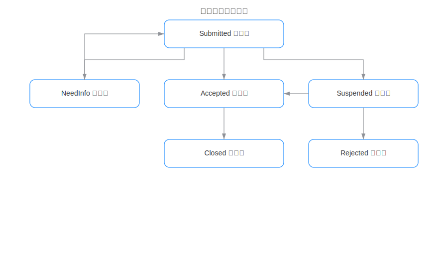

  # AIRVIEW 轻量化需求管理平台 — 使用指导

  > 适用对象：提交者 / 评审者 / 管理员
  > 核心能力：需求收集、评审流转、评论协作、附件、审计日志、数据看板、访问统计

  

  ## 1. 快速上手
  1. **访问登录页**：默认走 SSO，若调试或 SSO 异常，在 URL 追加 `?manual=1` 进入账号密码模式。
     - 首次启动默认管理员：`admin / admin123`（建议立刻修改或用 `ADMIN_PASSWORD` 设置）。
  2. **登录后落地仪表盘**：查看总览卡片、趋势、状态分布、留言板。
  3. **提交第一个需求**：点击“新建需求”，填写标题、描述、Why、可选字段后提交（状态初始为待评审）。
  4. **评审处理**（评审者/管理员）：在列表或详情执行 接纳/挂起/拒绝/待补充/关闭，必须填写原因；挂起需“复审时间或条件”至少一项。
  5. **跟进与补充**：在详情页评论沟通、上传附件（≤200MB），查看审计日志；待补充/挂起/拒绝可按规则重新进入评审。

  ## 2. 角色与权限
  - 请求者 `requester`：新建需求；在允许状态下编辑自己的需求；查看自己需求的状态、评论、附件。
  - 评审者 `reviewer`：查看全部需求；执行状态流转；编辑关键字段（优先级/分类/标签等）；评论。
  - 管理员 `admin`：拥有评审能力；用户管理；访问统计；可修改提交时间（用于补录）。
  - 审计：所有状态变更写入审计日志（操作者、时间、旧/新值、备注）。

  ## 3. 页面导览
  - **登录页**：SSO 自动跳转；支持切换“账号密码登录/注册”。
    
  - **仪表盘 `/dashboard`**：状态计数卡片（点击跳转列表）、近 7/14/30 天趋势、状态分布饼图、留言板（可匿名/置顶/删除）。
    
  - **需求列表 `/requests`**：
    - 筛选：关键字、状态、优先级、分类、标签；评审及以上可按提交者过滤。
    - 排序：创建/更新时间、优先级、状态；分页切换。
    - 行内操作：详情、接纳/挂起/拒绝/待补充/关闭（依据当前状态显示）。
    
  - **新建/编辑 `/requests/new|:id/edit`**：
    - 必填：标题、需求描述、期望价值（Why）。
    - 可选：分类、优先级、标签（多选/自定义）、验收标准、相关链接（每行一个，最多 20）、影响范围。
    - 管理员编辑时可改“提交时间”。
  - **需求详情 `/requests/:id`**：
    - 查看基础信息、最新处理意见、复审条件；相关链接、影响范围。
    - 协作：评论（可删除自己的/管理员可删）、附件上传与下载（≤200MB）。
    - 审计日志：状态变更、评论等操作留痕。
    - 流转：接纳/挂起/拒绝/待补充/关闭；待补充/挂起/拒绝可“重新进入评审”（请求者或评审权限）。
    
  - **用户管理 `/admin/users`（管理员）**：创建/编辑用户，设置角色，重置密码。
  - **访问统计 `/admin/visits`（管理员）**：近 N 天访问趋势、页面排行、角色分布、用户访问排行。

  ## 4. 状态与流转规则
  - 状态：Submitted（待评审）/ NeedInfo（待补充）/ Accepted / Suspended / Rejected / Closed。
  - 允许操作（满足角色权限前提）：
    - Submitted ↔ NeedInfo，Submitted → Accepted | Suspended | Rejected
    - NeedInfo → Accepted | Suspended | Rejected
    - Suspended → Submitted | Accepted | Rejected
    - Accepted → Closed
    - Rejected → Submitted（重新进入评审）
  - 必填/校验：
    - 所有评审动作需填写原因/处理意见。
    - 挂起需“复审时间”或“复审条件”至少一项。
    - 附件大小 ≤ 200MB。

  ## 5. 典型操作指南
  - **提交需求**：列表页点“新建需求” → 填写表单 → “提交需求”，跳转详情进入待评审。
  - **筛选检索**：列表页输入关键字或选择状态/优先级/标签；评审可按提交者过滤；重置恢复默认。
  - **状态评审**：在列表或详情点击对应按钮 → 填原因（挂起补充复审信息）→ 确认后写入审计并刷新。
  - **补充与重提**：在 NeedInfo 状态，提交者补充后“重新进入评审”；挂起/拒绝可由评审者或管理员重提。
  - **评论协作**：详情页输入评论 → 发布；可删除自己的评论，管理员可删除任何评论。
  - **附件管理**：详情页“上传”选择文件；上传后显示时间、上传者、大小；点击文件名即可下载。
  - **留言板互动**：仪表盘留言；管理员可置顶/取消置顶；作者或管理员可删除。
  - **用户与权限配置**：管理员进入用户管理 → 新建/编辑角色、重置密码。
  - **访问统计查看**：管理员在访问量统计页切换 7/14/30 天，查看趋势与排行。

  ## 6. 登录与退出
  - SSO：直接访问 `/login` 自动跳转；若回调失败会展示错误提示，可改用手动登录。
  - 手动登录：`/login?manual=1`；如需注册，切换“没有账号？去注册”。
  - 退出：右上角头像 → “退出”，会清除本地 token 并跳转后端登出再回到登录页。

  ## 7. 常见问题排查
  - **反复跳转/闪烁**：确认 `/authorize` 由后端处理（开发模式在 `vite.config.ts` 加代理；线上 Nginx 参考 `SSO_SETUP.md`）。
  - **无法登录**：检查账号密码或 SSO 错误提示；确认后端环境变量 `JWT_SECRET`、`ADMIN_PASSWORD` 已正确配置。
  - **看不到需求**：提交者仅能查看自己的需求；确认角色或联系管理员调整。
  - **状态按钮不可用**：当前状态不支持目标流转或无评审权限；查看上面的流转规则。
  - **附件上传失败**：检查文件是否超过 200MB 或网络中断。